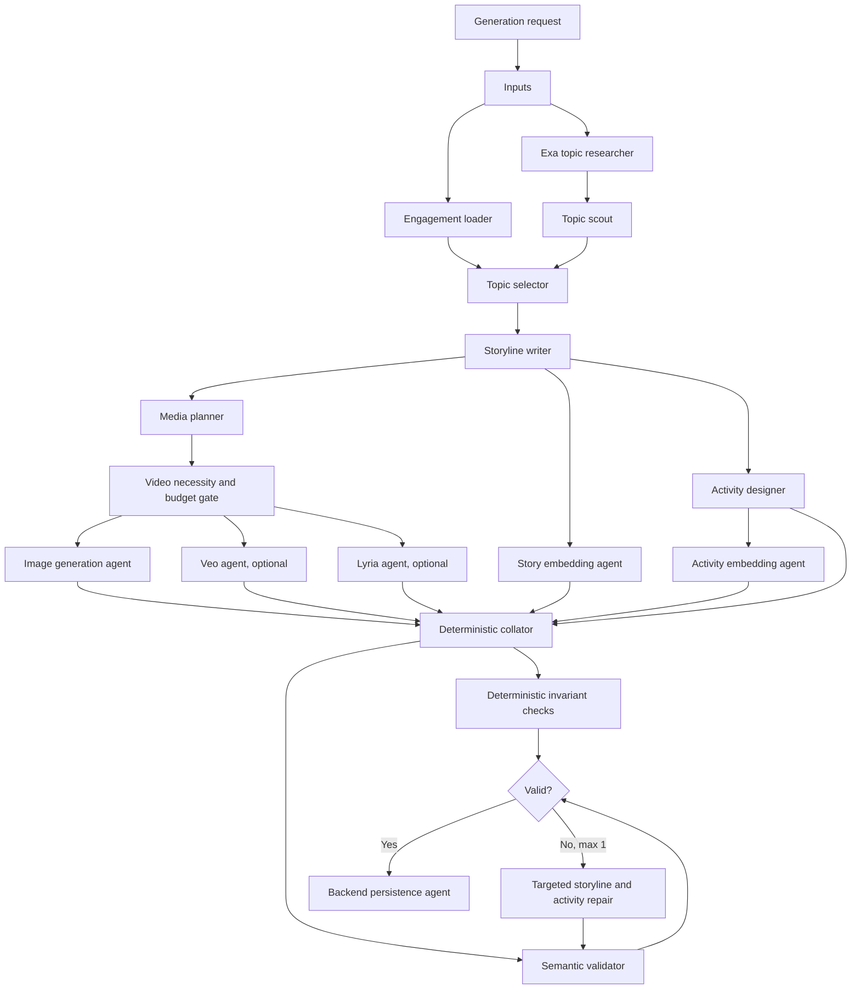

# Story generation pipeline

The Python service has two responsibilities: an asynchronous Google ADK pipeline that
builds complete stories, and a lightweight Gemini Flash thinking engine that
analyzes learner activity while a story is played.

## Live thinking engine

The frontend sends compact, server-side requests to `/prelude`, `/observe`, and
`/profile`. Each request includes the story's ordered activity sequence. Observe
and profile requests also include cumulative decisions, attempts, experiments,
hints, explanations, corrections, and prior model observations. Final profiles
include three to six small, evidence-backed details such as an exact correction,
value sequence, explanation, or shift between activities.

Gemini Flash may interpret this evidence, but it does not control story state,
correctness, branching, scores, or activity feedback. The deterministic engine
remains authoritative and limits live analysis calls to meaningful events. Model
failures use the existing deterministic partner responses, so the story remains
fully playable when live guidance is unavailable.

## Workflow



The supervisor is an ADK 2.x dynamic workflow. Each `ctx.run_node` execution is
tracked by ADK, and independent work uses `asyncio.gather` without unsupervised
tasks. Provider-backed nodes and LLM-backed agents are both first-class ADK
nodes.

## Agent responsibilities

| Agent | Responsibility | Model or provider |
| --- | --- | --- |
| Engagement loader | Fetch prior outcomes for open-ended discovery requests | Backend API |
| Exa topic researcher | Retrieve recent source text plus explicitly open-license Wikimedia Commons reference images | Exa |
| Topic scout | Produce grounded candidates only for open-ended requests | Fast Gemini model |
| Topic selector | Rank candidates only when the learner did not request a topic | Fast Gemini model |
| Storyline writer | Create the full three-act causal story graph | Quality Gemini model |
| Media planner | Produce consistent, evidence-bearing media briefs | Quality Gemini model |
| Image generation agent | Best-effort sequential scene images with spacing and a bounded batch deadline | Gemini native image generation on Vertex AI |
| Lyria agent | Best-effort instrumental background music | Lyria on Vertex AI |
| Activity designer | Produce declarative quiz, reorder, simulation, and reflection specs | Quality Gemini model |
| Embedding agents | Embed topic, story, scenes, and activities | Vertex AI embeddings |
| Collator | Assemble typed outputs without generative rewriting | Deterministic ADK node |
| Validator | Audit grounding, safety, pedagogy, plot, activities, and media | Quality Gemini model |
| Repairers | Repair storyline and individual activities once, in parallel | Quality Gemini model |
| Persistence agent | Atomically store the validated bundle | Backend API |

## Module layout

```text
agent/artham_partner/story_pipeline/
├── agent.py              # Native ADK CLI entry point
├── agents.py             # LlmAgent definitions only
├── clients/              # Exa, backend, signed upload, Vertex adapters
├── config.py             # Environment-backed deployment choices
├── constants.py          # Stable limits and default model IDs
├── contracts.py          # Strict Pydantic stage and wire contracts
├── jobs.py               # In-memory asynchronous job lifecycle
├── nodes.py              # Deterministic/provider ADK nodes
├── orchestrator.py       # Dynamic fan-out, gate, repair, and persist flow
├── partner_contracts.py  # Live analysis request/response contracts
├── partner_engine.py     # Gemini Flash thinking analysis
├── prompts/              # One prompt module per reasoning responsibility
├── runtime.py            # Dependency container
├── validation.py         # Non-LLM invariants and report merging
└── workflow.py           # Root Workflow factory
```

## Data rules

- Large binary media never enters ADK state, prompts, PostgreSQL, or job
  responses. It is uploaded through backend-issued signed object-storage URLs.
- Raw embedding vectors are omitted from the semantic validator prompt.
- Every factual candidate URL must come from Exa. The selector cannot rewrite a
  candidate, and storyline citations must be a subset of the selected evidence.
- Exa reference images are accepted only when the source page explicitly states
  Public domain, CC0, CC BY, or CC BY-SA. The image, source page, contributor,
  license, plain-language explanation, and why-it-matters context remain attached
  as one scene-local learning reference. Generated cinematic art remains separate.
- Activities are data, never generated code. Simulation conditions use a small
  control-to-number comparison subset and a trusted frontend renderer. Every
  observed simulation variable has a typed identity, linear, base-conversion, or
  lookup readout. The deterministic release gate proves the target is selectable,
  computes the success-state output, and rejects any mismatch between that output,
  the promised value, and the learner-facing guide.
- Veo generation is disabled and absent from the active workflow.
- Explicit topic requests skip engagement loading, topic scouting, and topic
  selection. The requested subject is deterministically grounded in Exa evidence.
- Reasoning, media, audio, and embedding stages are serialized and conservatively
  spaced to avoid bursts against shared Vertex quotas.
- Every storyline scene gets a dedicated image plus one cover image. When the
  media planner drops a scene, `_ensure_image_coverage` rebuilds the missing
  brief deterministically from the scene's own narrative and the style guide.
- Images are generated sequentially with a 45-second gap, a 240-second per-image
  deadline, and a 1500-second total batch budget. A rate-limit hit adds a
  180-second cooldown before the next request.
- Failed images are retried once after 120 seconds using a simplified,
  safety-neutral prompt. If any cover or scene image still fails, the whole job
  fails before persistence, so no partial bundle can become visible.
- Scoped retries preserve successful assets and regenerate only missing images,
  so a partial image run never requires a full, costly pipeline restart.
- Lyria audio is required whenever enabled. A failed requested audio asset blocks
  persistence rather than silently disappearing.
- The full ADK workflow has a hard 2700-second deadline and at most two repair passes,
  leaving enough time for the bounded 1500-second image batch plus reasoning,
  activities, audio, embeddings, validation, and persistence.
- Repairs never regenerate media, preventing duplicate media cost.
- Any repaired story or activity content receives fresh embeddings before final
  validation and persistence.
- Provider or backend failures fail the job explicitly. The player's
  deterministic runtime fallback remains separate from this production system.

## Story quality pattern

Generated stories follow the same reusable quality pattern as Artham's strongest
authored scenarios: a learner with credible authority enters an observable problem,
diagnoses one causal system, applies a constrained intervention, sees that fix
tested by a changed condition, and chooses a durable resolution. Activities operate
the story system rather than interrupt it with recall questions. Media depicts the
crisis, evidence, intervention, reversal, and resolution with consistent production
details instead of generic infographic art.

## Extension points

Add a subject by returning a new `SubjectRef`; no central enum changes are
required. Add an activity renderer by extending `ActivityKind`, its typed
payload, the activity prompt, deterministic checks, and the frontend renderer.
Add a provider by implementing a client method and a provider-backed ADK node;
the collator accepts only `AssetReference`, so provider details do not leak into
the final story schema.

Model identifiers are deployment configuration because Vertex preview models
and locations change independently of pipeline logic.
