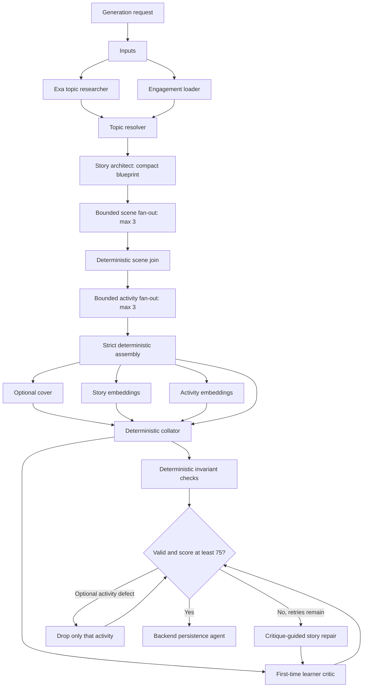

# Story generation pipeline

The Python service has two responsibilities: an asynchronous Google ADK pipeline that
builds complete stories, and a lightweight LiteLLM thinking engine that
analyzes learner activity while a story is played.

## Live thinking engine

The frontend sends compact, server-side requests to `/prelude`, `/observe`, and
`/profile`. Each request includes the story's ordered activity sequence. Observe
and profile requests also include cumulative decisions, attempts, experiments,
hints, explanations, corrections, and prior model observations. Final profiles
include three to six small, evidence-backed details such as an exact correction,
value sequence, explanation, or shift between activities.

GPT-5.4 may interpret this evidence through LiteLLM, but it does not control story state,
correctness, branching, scores, or activity feedback. The deterministic engine
remains authoritative and limits live analysis calls to meaningful events. Model
failures use the existing deterministic partner responses, so the story remains
fully playable when live guidance is unavailable.

## Workflow

### Beginner-first teaching and difficulty

The `/create` form exposes Easy, Medium, Hard, and Adaptive radio choices.
The selected value is included in both the prompt preview and the generation
request. All levels assume zero prior knowledge; difficulty changes reasoning,
not jargon or prerequisite knowledge:

- **Easy** uses one relevant clue in a guided, one-step application.
- **Medium** connects two or three taught clues across at least two reasoning
  steps and rules out a plausible alternative.
- **Hard** includes at least two demanding moments involving interacting taught
  constraints, incomplete or partly conflicting evidence, plausible competing
  solutions, a defensible tradeoff, and revision after a changed condition.
- **Adaptive** selects one concrete level from relevant learning history and then
  follows that complete rubric; without useful history it selects Easy.

The critic reports `DIFFICULTY_TOO_LOW` when a requested Hard story only performs
Medium-level reasoning and caps its quality score at 70 so the single repair cycle
deepens the decisions. `DIFFICULTY_TOO_HIGH` identifies Easy or Medium stories that
exceed their requested reasoning burden. Neither condition is repaired by adding
jargon, hidden prerequisites, arbitrary calculations, or extra mechanisms.

Research requests foundational explanations, not just discovery reports. The
architect plans the explanation ladder in each scene's `learning_purpose` and
source-supported `required_facts`. Scene workers receive earlier teaching plans
as context, but must explain needed prerequisites in their own narrative rather
than assuming another parallel worker taught them. Essential teaching must precede
questions and cannot depend on optional cards, media, hints, or answer feedback.

The critic reads in story order as a first-time learner, checking for both
`ASSUMED_PRIOR_KNOWLEDGE` and `MISLEADING_SIMPLIFICATION`. Story repairs also
realign activities attached to changed scenes. These quality findings use the
existing bounded repair/persist-with-warnings flow; they do not add retries.
Prompt updates affect newly generated or repaired content, not existing saved stories.

Validation follows the generation prompts rather than adding stricter prose rules.
There is no fixed sentence word limit: `NARRATIVE_TOO_COMPLEX` is a contextual,
non-blocking readability warning, never a word-count failure. Tables, diagrams,
and dialogue formatting are not sentence-length proxies. Missing prerequisites
and misleading explanations are still audited separately. Advisory deterministic
findings no longer force the quality score down to 60.

Deterministic checks preserve the requested subject/parent-topic mapping and an
explicit Easy, Medium, or Hard selection; adaptive reasoning is reviewed by the
critic. Primer requirements count useful ideas, not new technical terms.
The critic checks learner agency in context, rather than rejecting a story merely
because another character is called an assistant. Optional generated media stays
optional, including cover-only stories.

### Story presentation and closure

Rich presentation is restricted to scene narrative. Every spoken line, including
embedded dialogue, uses `***“Dialogue.”***`. Only a few indispensable terms whose
meaning is essential to following the story use `**bold**` (the UI adds underline
styling, not raw HTML). Decorative wording, ordinary actions, whole sentences, and
repeated occurrences are not highlighted. Purposeful blockquotes, lists, comparison
tables, Mermaid, and illustrative fenced code are welcome in narrative without a
per-scene checklist. Narrative also includes a small number of relevant emojis that
reinforce the setting, action, mood, or idea without random decoration or clutter.

Story and chapter titles, captions, beats, primers, trivia, activities, feedback,
hints, media fields, partner copy, and metadata remain plain text without Markdown
or emojis. **In plain words** remains the learner-facing UI label; internal
`concept` fields stay unchanged.
Code examples are static text, never executable behavior; Mermaid must render
safely without scripts, click actions, remote content, or HTML labels. Raw HTML,
embedded narrative links, and Markdown images remain disallowed.

Essential beginner explanations unfold through action, evidence, and conversation,
not lectures or technical tangents. Endings resolve the situation happily through
the learner's earned decision and a warm character callback, without fabricated
cures, approvals, or unsupported benefits.

“See the real thing” learning-reference cards are temporarily disabled. Generation
prompts keep their reference fields empty, and orchestration clears those fields
without calling the reference-image search path. Existing stored cards remain
compatible and are not retroactively removed from saved stories.



The supervisor is an ADK 2.x dynamic workflow. Each `ctx.run_node` execution is
tracked by ADK, and independent work uses `asyncio.gather` without unsupervised
tasks. Provider-backed nodes and LLM-backed agents are both first-class ADK
nodes.

## Agent responsibilities

| Agent | Responsibility | Model or provider |
| --- | --- | --- |
| Engagement loader | Fetch prior outcomes for open-ended discovery requests | Backend API |
| Exa topic researcher | Retrieve recent source text for grounded teaching | Exa |
| Topic resolver | Select one grounded topic for open-ended requests | Fast LiteLLM model |
| Story architect | Create a compact three-act blueprint and continuity bible | Strong LiteLLM model |
| Scene chunk worker | Expand exactly one scene specification | Fast LiteLLM model, maximum three concurrent calls |
| Activity chunk worker | Create exactly one scene activity | Fast LiteLLM model, maximum three concurrent calls |
| Image generation agent | Generate the single required cover image | Gemini native image generation on Vertex AI |
| Lyria agent | Best-effort instrumental background music | Lyria on Vertex AI |
| Embedding agents | Embed topic, story, scenes, and activities | Vertex AI embeddings |
| Collator | Assemble typed outputs without generative rewriting | Deterministic ADK node |
| Critic | Review as an interested 15-year-old, score the learning experience, and return actionable priorities | Strong LiteLLM model |
| Story repairer | Apply the critic's priorities when validation fails or the learner score is below 75 | Strong LiteLLM model, maximum two repair cycles |
| Persistence agent | Atomically store the validated bundle | Backend API |

## Module layout

```text
agent/artham_partner/story_pipeline/
├── agent.py              # Native ADK CLI entry point
├── agents.py             # LlmAgent definitions only
├── clients/              # Exa, backend, signed upload, Vertex adapters
├── config.py             # Environment-backed deployment choices
├── constants.py          # Stable limits and default model IDs
├── contracts.py          # Strict Pydantic stage and wire contracts
├── jobs.py               # Durable ADK session and invocation lifecycle
├── nodes.py              # Deterministic/provider ADK nodes
├── orchestrator.py       # Dynamic fan-out, gate, repair, and persist flow
├── partner_contracts.py  # Live analysis request/response contracts
├── partner_engine.py     # LiteLLM thinking analysis
├── prompts/              # One prompt module per reasoning responsibility
├── runtime.py            # Dependency container
├── validation.py         # Non-LLM invariants and report merging
└── workflow.py           # Root Workflow factory
```

## Data rules

- Large binary media never enters ADK state, prompts, PostgreSQL, or job
  responses. It is uploaded through backend-issued signed object-storage URLs.
- Raw embedding vectors are omitted from the semantic validator prompt.
- Every factual candidate URL must come from Exa. The selector cannot rewrite a
  candidate, and storyline citations must be a subset of the selected evidence.
- Exa learning-reference image lookup is temporarily dormant. The related contract
  fields remain for backward compatibility with stored stories.
- Activities are data, never generated code. Simulation conditions use a small
  control-to-number comparison subset and a trusted frontend renderer. Every
  observed simulation variable has a typed identity, linear, base-conversion, or
  lookup readout. The deterministic release gate proves the target is selectable,
  computes the success-state output, and rejects any mismatch between that output,
  the promised value, and the learner-facing guide.
- Veo generation is disabled and absent from the active workflow.
- Explicit topic requests skip engagement loading, topic scouting, and topic
  selection. The requested subject is deterministically grounded in Exa evidence.
- Strong-model calls are serialized. Scene and activity workers use separate
  bounded semaphores with at most three concurrent calls and no fixed delay after
  a successful request.
- The active policy honors the request's independent cover and scene-image
  choices and permits no video. When requested, the cover is generated first;
  its image bytes are then attached as a conditioning
  reference to every subsequent per-scene image request (via multimodal
  `generate_content` input) so characters, palette, and art style stay
  consistent across the story without merging outputs into one shared image.
  A cover-enabled job cannot report success if the requested cover fails both
  generation attempts; optional scene-image failures still do not block the story.
  This reference is only available in-memory for the run that generated the
  cover — resumed jobs that reuse an already-uploaded cover fall back to
  unconditioned scene generation.
- Each successful scene and activity is checkpointed in the ADK database session
  immediately. A malformed item retries only that item; failed optional
  activities are omitted while valid siblings remain.
- The architect owns the complete interaction outline before scene and activity
  workers fan out. Every story includes at least one evidence-based quiz and one
  story-native simulation with meaningful controls. Other activity kinds and their
  placement vary with the plot rather than repeating a fixed template. New
  questions are open-ended so they capture the learner's reasoning.
- The final critic reads the requested topic and story as an interested
  15-year-old learner. A validation failure or score below 75 triggers a
  critique-guided repair and revalidation, bounded to two cycles. Rewritten text
  receives fresh embeddings before persistence.
- Lyria audio is required whenever enabled. A failed requested audio asset blocks
  persistence rather than silently disappearing.
- Image generation, requested background audio, and story/activity embeddings
  run concurrently after strict assembly.
- Restart hydration restores jobs and checkpoints from
  `DatabaseSessionService`. A retry starts a new invocation in the same durable
  session because cached dynamic children intentionally change the replay
  sequence; completed chunks are loaded from session state and skipped.
- Provider or backend failures fail the job explicitly. The player's
  deterministic runtime fallback remains separate from this production system.

## Story quality pattern

Generated stories follow the same reusable quality pattern as Artham's strongest
authored scenarios: a learner with credible authority enters an observable problem,
diagnoses one causal system, applies a constrained intervention, sees that fix
tested by a changed condition, and chooses a durable resolution. Activities operate
the story system rather than interrupt it with recall questions. Media depicts the
crisis, evidence, intervention, reversal, and resolution with consistent production
details instead of generic infographic art.

## Extension points

Add a subject by returning a new `SubjectRef`; no central enum changes are
required. Add an activity renderer by extending `ActivityKind`, its typed
payload, the activity prompt, deterministic checks, and the frontend renderer.
Add a provider by implementing a client method and a provider-backed ADK node;
the collator accepts only `AssetReference`, so provider details do not leak into
the final story schema.

Model identifiers are deployment configuration because Vertex preview models
and locations change independently of pipeline logic.
